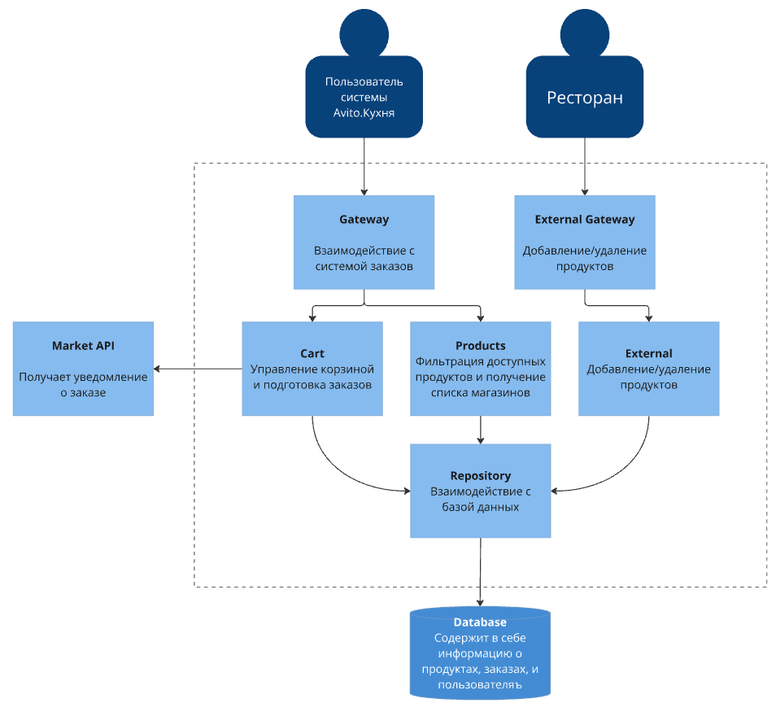
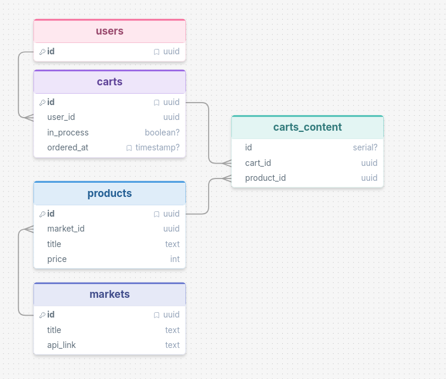

# Описание проекта
Данный проект представляет из себя два сервиса - backend и market.

## Backend

Сервер Avito.Кухня, на котором можно посмотреть доступные рестораны и блюда, а также заказать их.
Данный сервер способен получать меню ресторанов и направлять им готовые заказы от пользователей

Полное описание api предоставлено в директории backend/api, либо при развертке по адресу http://.../swagger

## Market

Сторонний сервер, эмулирующий внутреннее API ресторана. Способен добавлять, изменять и удалять продукты(блюда), при этом уведомляя Backend об изменении.

Полное описание api предоставлено в директории market/api, либо при развертке по адресу http://.../swagger

## Architecture

Использована трёхслойная архитектура, что позволяет избежать лишних зависимостей, упрощает разработку, и позволяет масштабировать проект.

## Пример пользования
<em>Наглядно описанное ниже можно увидеть в workflow.puml</em>

При создании Market добавляет себе(и соответственно, в Backend) тестовый продукт. Также, его можно добавить, изменить, или удалить самостоятельно(см. http://.../swagger)

Пользователь получает корзину для заказов /api/cart

Затем, пользователь ищет определённый продукт с помощью /api/filter, получая его id

Данный товар он добавляет в корзину /api/cart/add

Далее, он делает заказ с помощью /api/order
Здесь, сначала Backend изменяет флаг корзины на "в процессе", затем отправляет в Market заказ, затем добавляет время заказа корзине, теперь она считается завершенной.

## Трудности и упрощения
Для меня в этом проекте было 2.5 трудности:
- ТЗ давало огромный простор для фантазии, даже слишком огромный. Пришлось очень много думать, что стоит добавить, что не стоит. Даже учитывая заранее продуманную архитектуру, по ходу написания кода пришлось отбросить несколько идей, так как они заняли бы слишком много времени, но в то же время что-то приходилось добавлять. Интересно, но немного стрессово из 10
- Техническое: понадобилась идемпотентность и атомарность совершения заказа. Было несколько идей, 
в итоге пришел к тому, что атомарности добиться в этом варианте не получится. Однако, в итоге нынешнее решение гарантирует то, что один и тот же заказ не станут готовить снова(благодаря проверке in_process и ordered_at)
- Разрывался между идеей, стоит ли оставить возможность заказывать из разных мест. В итоге оставил, и теперь каждому ресторану шлётся свой отдельный заказ с соответствующими ему блюдами.

В угоду скорости и по ТЗ были следующие упрощения, которые я очень хотел бы доделать, будь у меня возможность:
- Вместо многих юзеров в проекте сейчас один(его uuid можно найти в БД, это uuidNil с последним байтом 1). При любом взаимодействии с системой с вэб стороны автоматически считается, что вы - этот пользователь
- Каждому стороннему ресторану по хорошему должен генерироваться токен, по которому он бы идентифицировался, но пока что верим на слово
- На данный момент "заказа" как объекта в БД не существует, вместо корзина сохраняется как завершенная
- Некоторые переменные захардкожены

## Использование ИИ
ИИ был использован по ходу проекта как подсказки при написании кода, а также Market был сгенерирован по большей части им(Claude Haiku 4.5), а затем про код-ревьюен и слегка доделан. Использовались следующие запросы: 
> В директории backend_market создай простое бэкэнд приложение, которое принимает следующие http запросы:
пинг, вывод доступных товаров из базы(смотри models.Product), добавление или изменение товара себе в базу + запрос к основному серверу с добавлением того же товара(сомтри server/external.go), удаление товара + уведомление сервера, сохранение заказа(models.Order) себе в базу данных(при этом, не может быть двух заказов с одинаковым id).

> Сделай такую же архитектуру, как и в /backend

> Вместо реляционной базы данных храни всё локально в map и slice

# Деплой

1) Склонировать проект в локальное пространство
2) Перейти в директорию deploy
3) Настроить config.env нужным образом(названия сервисов в docker-compose и порты в deploy захардкожены в БД, меняйте с осторожностью)
4)     sudo docker compose -f docker-compose.yml --env-file config.env up -d 
5) PROFIT
